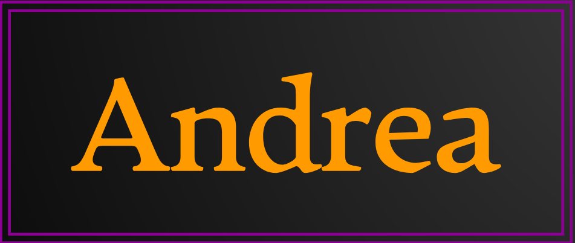
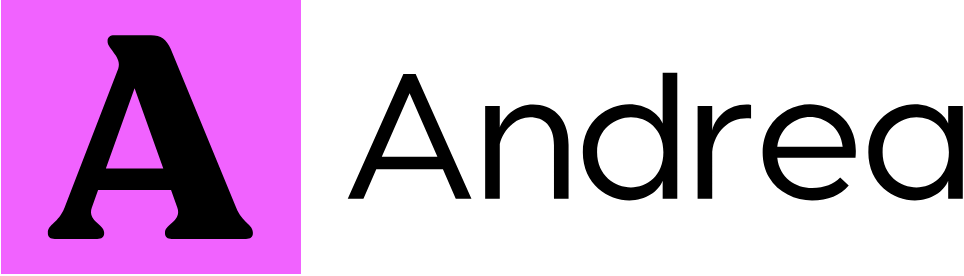

# Devoir de communication SAé Semestre 3

 

 
Lors de ce projet, nous serons menés à créer un site composé de plusieurs pages. Le but de ce site est de mettre en place une plateforme d'assistance technique via le système de ticketing. Le ticketing est un système généralement utilisé dans l'assistance aux utilisateurs. Un utilisateur rencontre un problème, et fait une demande d'assistance en remplissant un petit questionnaire pour décrire le problème. Des techniciens sont, soit désignés pour prendre en charge le problème de l'utilisateur, soit regardent la description du problème et choisissent si ils le prennent en charge si ils en ont les compétences ou le laissent à un autre technicien. Ce site étant un site d'assistance, orienté vers l'informatique, nous avons décidé de privilégier la sobriété et l'accessibilité. Nous allons dans un premier temps definir la charte graphique du site, puis nous présenteront  les deux logos proposés.

 

Comme dit précédemment, le site met l'accent sur la sobriété et l'accessibilité. Pour cette raison, nous n'avons pas ajouté beaucoup de couleurs. Les principales couleurs utilisées sont le noir et le blanc, des couleurs classiques. Ces couleurs permettent d'être sur de ne pas provoquer de mauvais contrastes. Elles permettent aussi de rendre le site plus accessible aux daltoniens. Pour les autres couleurs, nous avons choisi le violet et le orange. Le orange symbolise la chaleur qui représente l'accueil  chalereux donné aux utilisateurs et le violet représente l'imagination et la créativité du fait que c'est une couleur peu standard et montre l'imagination et la créativité des techniciens pour parvenir à aider les utilisateurs. La police que nous avons choisi est une police plus grande et large permettant aux utilisateurs malvoyants ou ayant des troubles visuels de parcourir le site. La forme de la police est classique pour ne pas créer de conflits ou de débordements avec le reste des éléments. Pour les formes, nous avons des formulaires et des tableau qui sont des carrés en milieu de page pour une lecture et une compréhension simple et rapide.

 

Au travers de la forme visuelle de ce site, nous avons voulu exprimer plusieurs choses. Parmi elles, on peut trouver l'accessibilité. l'accessibilité est le fait de rendre  utilisables ou faciliter l'utilisation d'un produit ou services pour des personnes dotées de handicaps, moteurs ou comportementaux. Nous avons exrimé cette valeur par l'utilisation de couleurs et de polices adaptée. Pour ce faire, nous avons utilisé une norme appelée WCAG qui est un ensemble de normes dédiées à l'accessibilité du web. Nous avons aussi utilisé une extension appelée WAVE permettant de vérifier les problèmes d'accessibilité, comme notamment le contraste des couleurs. Notre site est aussi chaleureux et bienveillant, les couleurs sont plûtot tropicales, le site est aéré et attire l'utilisateur vers le centre de la page. Les accès vers les différentes pages sont très distincts et faciles d'accès.

 

Le premier logo est un logo typographique. Il a été fait à l'aide d'un site web qui s'appelle [looka](https://www.looka.com). Le site permet de choisir des caractéristiques et de générer des modèles que l'on peut ensuite personnaliser. Le site est gratuit et simple à utiliser. le logo est un texte utilisant les couleurs évoquées auparavant. Le nom de l'application est écrit dans une police sobre et légèrement arrondie en orange. le logo est un rectangle et le fond est noir. Les contours du rectangle sont violets. Nous avons choisi ces caractéristiques car elles représentent les valeurs citées plus tôt. Le nom de l'entreprise est présenté dans un orange vif qui lui permet de ressortir au premier coup d'oeil. La simplicité du logo permet au nom d'attirer le regard de l'utilisateur. Le fond noir met encore plus en avant le orange du nom grâce à un fort contraste. Les contours utilisent la deuxième couleur présentée précédemment le violet. Les contours violets permettent d'ajouter une touche plus excentrique au logo. En effet, un logo noir avec le nom orange aurait été bien mais trop classique, peu original. Le violet permet au logo d'attirer la curiosité de l'utilisateur. Qu'il le trouve beau ou pas, l'utilisateur ne pourra pas passer à côté de ce logo sans se poser de question.

 

Le deuxième logo est un logo combinaison lettres/images. Il a aussi été fait sur le site web [looka](https://www.looka.com), comme le premier logo. Ce logo est un texte noir sans fond placé à côté d'une icône qui est une lettre noire sur un fond violet. Le nom de l'application est écrit dans une police droite aux bords légèrement arrondis. L'image à coté est la première lettre du nom de l'application écrite dans une police large, aux bords arrondis. La lettre est placée au centre d'un carré violet. Nous avons choisi ces caractéristiques car elles représentent un style plus moderne, qui correspond au domaine d'utilisation de l'application. Le nom de l'entreprise est un texte noir sans fond ce qui permet de l'intégrer à des fonds de différentes couleurs. Ce choix a été fait avec l'intention d'utiliser le logo dans un fond orange. C'est pour cette raison que le logo lui-même ne contient pas la couleur orange, une des couleurs principales de l'application. Pour ce qui est de l'image, La lettre est large pour la rendre très visible et pour attirer le regard de l'utilisateur. Elle est écrite en noir pour faire un contraste fort avec le violet du fond. On a préféré opter pour un carré car les autres formes ne allaient pas vraiment avec le style sobre recherché. Ce logo est sobre, classique et léger tout en étant moderne.

 

Nous avons choisi d'utiliser le second logo car il est plus sobre et s'intégrera mieux dans l'application. En effet, le second logo n'ayant pas de fond, il se fondra mieux dans la page là où le premier serait trop brut et ne s'harmoniserait pas assez avec la page. De plus, le premier logo manque de formes, il ne s'agit que d'un texte dans un rectangle. Le jeu de couleurs aurait été bien mais comme dit ci-dessus, nous allons utiliser les fonds de la page comme couleur secondaire, ce qui rend la combinaison des couleurs inutile. De ce fait, les formes du second logo en font un meilleur choix.

