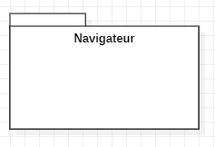
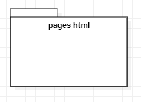
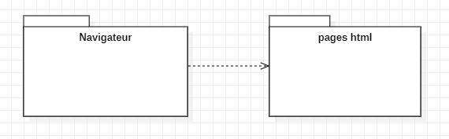
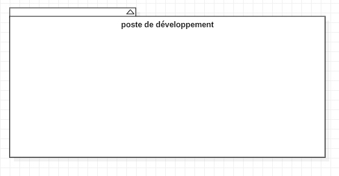
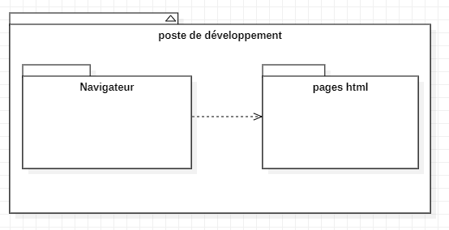

# Conception du livrable V0_1

La figure **conception vue modulaire** représente une vue modulaire du système actuel du livrable V0_1.

- On crée le composant **navigateur** en tant qu'abstraction du navigateur que l’on utilise.

****
- On crée le composant **page HTML** abstraction du package qui contient toutes les pages HTML de notre maquette

****
- On crée une **dépendance** du package navigateur vers le package qui contient toutes les pages html

****
- On crée un modèle **poste de développement**, abstraction du poste de développement que l'on utilise pour concevoir notre projet 

****
- Pour conclure notre diagramme de package, on ajoute à notre modèle les deux packages et la dépendance.
