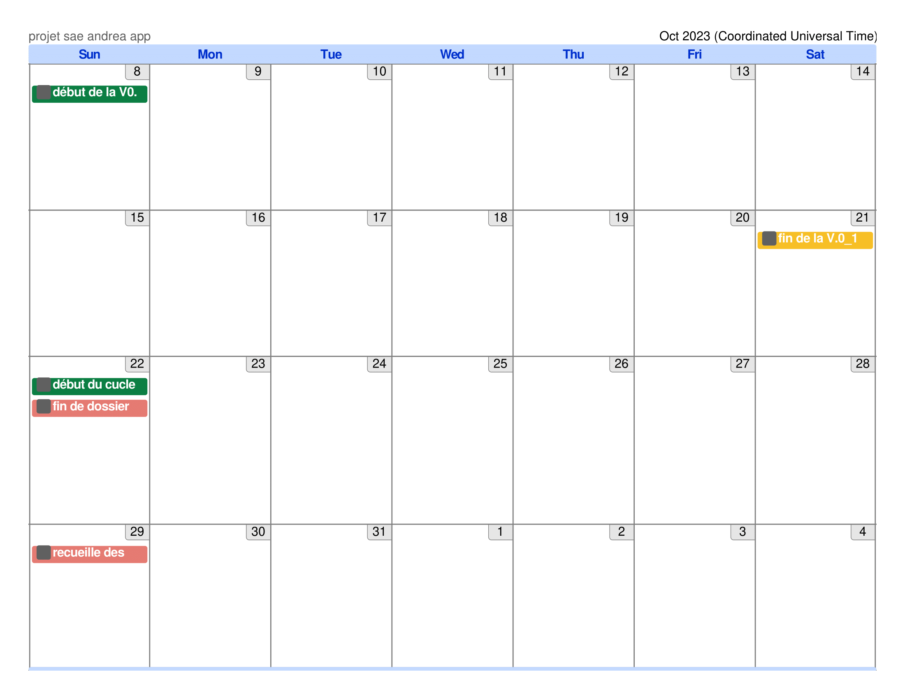

## IV.partie 4 : Priorités

Dans ce projet, nous avons certaines priorités qui nous sont imposer et d'autres que l'on ces mises sont toute écrites dans le planning suivant:

8 octobre : Début du premier cycle de la V0.1 création des pages web en html et maquette 

21 octobre : Fin du premier cycle de la V0.1

22 octobre : Début du deuxième cycle de la V0.2 implémentaion de la gestion d'utilisateur 
, fin du dossier de comunication sur la charte graphique de l'application 

29 octobre : fin du recueilles des riques 

11 novembre : fin du deuxième cycle de la V0.2

12 novembre : Début du deuxième cycle de la V0.3 implémentation sur carte sd et sur serveur RPI4

18 novembre : fin du deuxième cycle de la V0.3

19 novembre : Début du deuxième cycle de la V0.4 implémentation de la gestion de ticket

2 décembre : fin du deuxième cycle de la V0.4 et version final de l'application 

cette partie du cahier des charges est voué à changer tout comme le planning 